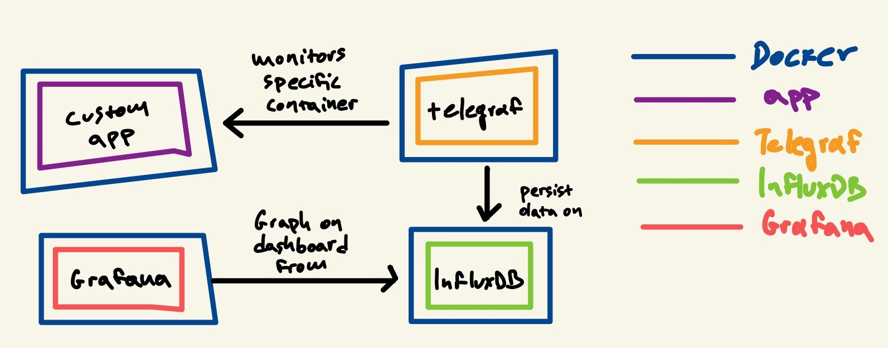
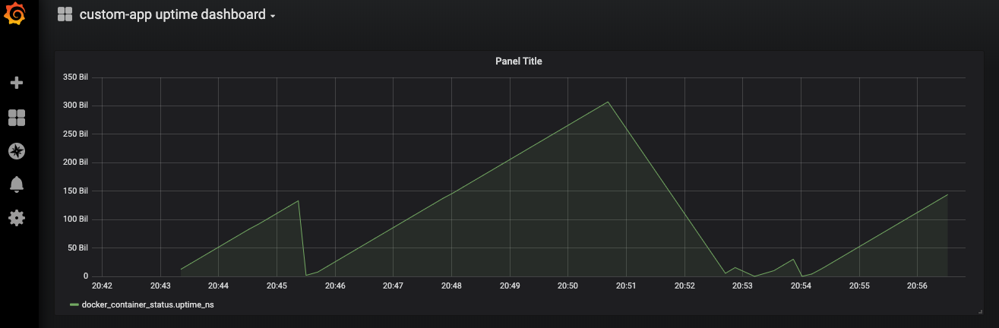

###Context:
This is a simple setup where an application named `'custom-app'` runs on a docker container. The application has a
single endpoint, which when called, kills the long running process (app). The app goes down when making a GET request
to http://localhost:49160/api/down. When taken down the app spins back up.

`Telegraf` is used to collect docker inputs coming from 'custom-app' only. The inputs are persisted on `InfluxDB`.
`Grafana` is used to visualize the collected information. The dashboard is created automatically and simply shows the uptime
of custom-app. Telegraf, InfluxDB and Grafana all run on docker containers

The setup looks like this:


###How to run:
```bash
docker-compose up
```

###How to use:
Go to http://localhost:3000/ and login using `admin/secret`.
The available dashboard is called (unimaginatively) `'custom-app uptime dashboard'`. 

You can use the 'kill endpoint' and see the changes reflected in your monitoring dashboard.

The dashboard will look similar to this:



###Shortcuts taken:
- All basic authentication values are hardcoded in the project (various places) instead of using environment variables and use the native 
platform solutions for keeping secrets. 

###Sources used:
- [Get system metrics for 5 min with Docker, Telegraf, Influxdb and Grafana](https://towardsdatascience.com/get-system-metrics-for-5-min-with-docker-telegraf-influxdb-and-grafana-97cfd957f0ac)
- [Running Telegraf inside a docker container](https://www.jacobtomlinson.co.uk/monitoring/2016/06/23/running-telegraf-inside-a-container/)
- [cirocosta/sample-grafana](https://github.com/cirocosta/sample-grafana)
- [cristianpb/telegraf-influxdb-grafana-docker](https://github.com/cristianpb/telegraf-influxdb-grafana-docker)


